[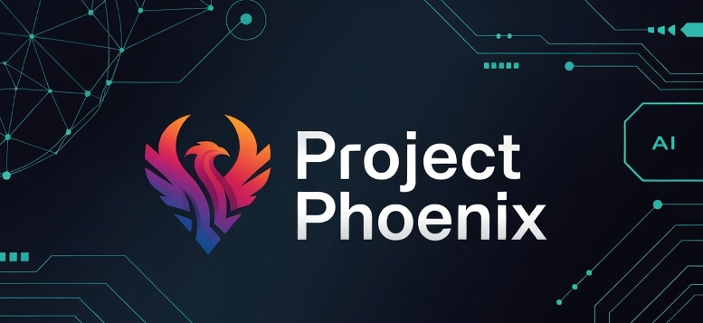](https://github.com/erwinpasia/The_Project_Phoenix)

> "Project Phoenix is a commitment to reinvention. Born during the global mid/post-COVID shift, it began as a personal mission: to rise from uncertainty with new purpose, new capabilities, and a future-proof identity in the world of advanced technology.
>
> What started as introspection, evolved into a structured end-to-end transformation of skillset rebuilding. From the ground up with the "discipline of an engineer" and the "curiosity of a founder". Project Phoenix represents a journey to master Applied AI Engineering, Full Stack Data Science, and the "Systems-Thinking mindset" required to build impactful technology products."

## **Professional Credentials & Capstone Projects Portfolios in:**
## *- Applied AI Engineering*
## *- Full Stack (E2E) Data Science*

This advanced training program became a core pillar of **Project Phoenix** and supported its mission of intentional reinvention. It delivered *Applied AI Engineering and End-to-End Data Science* training shaped by a research university and industry leaders in *GPU Accelerated Computing, Data, AI, and Automation*. The program blended hands-on execution with the systems-thinking mindset that Project Phoenix represents, while also providing graduate-level credits toward long-term academic goals.

The curriculum followed the **Data Science Hierarchy of Needs** and strengthened both **engineering discipline** and **founder-level curiosity**. Every track included practical projects tied to real industry challenges.

### Program Highlights

- **GenAI, LLM, ML, DL, MLOps:**  
  Completed NVIDIA's *Deep Learning* and the IBM's *AI Engineering Professional* training. Delivered multiple capstone projects demonstrating proficiency across model development and deployment. Finished DeepLearning.AI’s MLOps specialization with real production deployments.

- **High Performance Computing:**  
  Built advanced GPU computing skills with NVIDIA's *CUDA across C, C++, and Python* through projects that mirrored real GPU workloads.

- **Advanced Data Analytics and GPU Accelerated Data Science:**  
  Completed NVIDIA's *Accelerated Data Science with RAPIDS* and a full GPU-Accelerated Data Science project. Strengthened core math and analytics through Imperial College London’s *Mathematics for Machine Learning* and IBM’s *Data Science Professional* training, each with hands-on capstone work.

- **Foundational Data Analytics:**  
  Earned the foundational Google's *Data Analytics Professional* training, culminating in a practical capstone (R Programming) that solved real analytical challenges.

- **Data Warehouse Architecture and Big Data Engineering:**  
  Completed the IBM's *Data Engineering Professional* training with a capstone focused on industry-grade Data Warehouse and Big Data solutions.

- **Data Collection Automation:**  
  Completed the Google's *IT Automation with Python Professional* training with real-world automation projects.

This experience advanced **Project Phoenix’s** larger purpose: rebuild from the ground up, **merge engineering execution with entrepreneurial vision**, and create a launchpad for future **AI-driven ventures**.

---
 
## 1. Common Misconceptions About AI:
[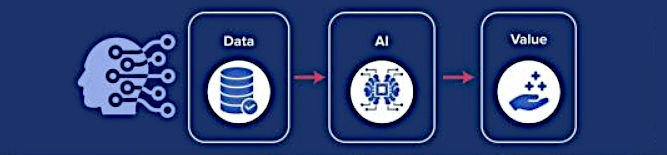](https://github.com/erwinpasia/The_Project_Phoenix)

AI is often mistakenly viewed as a "black box", a seemingly magical process where raw data enters, and actionable insights exit, with little understanding of what happens in between. This view can be misleading, as it oversimplifies the intricate work involved. "AI is not magic; it’s the synergy of Applied Mathematics, sophisticated Algorithms, Computer Science, and immense volumes of data". Behind the scenes, achieving meaningful AI outcomes requires a rigorous multi-step process that goes far beyond merely feeding data into a model.

In reality, AI applications involve a journey that includes data preparation, model development, and continuous monitoring to ensure both accuracy and ethical considerations. AI, is not a one-step pipeline but a complex process involving methodical effort across data engineering, modeling, and iteration. Only through this multi-layered approach can AI reach its full potential, delivering insights that are accurate, ethical, and truly valuable.

## 2. Addressing AI's Constraints:

To deploy AI responsibly, it's essential to navigate several constraints:

- **Legal Compliance:** *Adherence to regulations like GDPR, HIPAA, et.al. is critical to safeguard user data and privacy.*

- **Ethics and Transparency:** *AI systems must be transparent and fair, promoting trust and preventing misuse.*

- **Historical Bias:** *It’s crucial to avoid embedding past biases into AI models, ensuring they provide equitable outcomes.*

- **Security:** *Protecting sensitive data from breaches or unauthorized access is paramount in AI development.*

These factors guide responsible AI development, ensuring the systems we create are trustworthy, ethical, and secure.

## 3. Understanding the Real AI Process:
[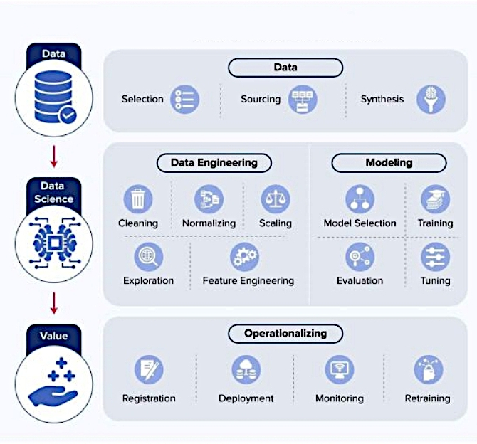](https://github.com/erwinpasia/The_Project_Phoenix)

AI isn’t just about data in and insights out, it’s a complex, multi-disciplinary process. Here's a closer look at the key stages:

- **Data Management:** *The foundation of AI starts with selecting, sourcing, and synthesizing the right data.*

- **Data Engineering:** *This is where the data undergoes cleaning, normalization, and scaling to ensure it is ready for analysis.* 

- **Data Science:** *This plays a crucial role in exploring the data and performing feature engineering to extract meaningful insights.*

- **Modeling:** *This involves selecting appropriate models, training them, and tuning their parameters for optimal performance. Once the models are developed, they are "evaluated" to ensure accuracy and reliability.* 

- **Operationalization:** *The final step, which includes registering, deploying, monitoring, and retraining models as needed to maintain their effectiveness over time.*

Throughout the process, it’s essential to address constraints like legal, ethical, and security concerns, ensuring AI is both effective and responsible.

## 4. Building a Techpreneur Skillset: Applied AI Engineering & E2E Data Science + Entrepreneurship
A Techpreneur skillset that combines Applied AI Engineering & E2E Data Science with Entrepreneurship provides the foundation to build and scale innovative tech ventures. It develops a holistic understanding of the AI and data pipeline; spanning data selection, model development, and deployment in production, while integrating business strategy, innovation, and market scalability. Through hands-on capstone projects, learners gain professional-level expertise in end-to-end data science (E2EDS), paired with entrepreneurial acumen to transform ideas into viable, scalable startups. Delivered in collaboration with leading research universities and top technology companies specializing in GPU-accelerated computing, AI, data, and automation, the program not only builds real-world competence but also opens pathways to advanced-degree opportunities and future-focused leadership in tech entrepreneurship.

Based on Monica Rogati’s "Data Science Hierarchy of Needs," the curriculum provides a strong foundation in both the theory and practical application of data science, covering key competencies:

- **Entrepreneurship Specialization:** *Focused on building scalable ventures through strategic leadership and techpreneurship. Expertise includes business model development, market analysis and customer insights, lean startup methodologies and MVP creation, team building and leadership, strategic growth planning, startup financing and profitability, pitching and communications, as well as innovation and problem-solving.*

- **GPU-Accelerated Computing & High-Performance Computing (HPC):** *Utilizing advanced hardware and GPU acceleration for faster model training, enabling handling of large-scale data science workloads.*

- **MLOps & DataOps:** *Automating the deployment, monitoring, and lifecycle management of AI/ML models, ensuring continuous integration and delivery (CI/CD) in production environments.*

- **AI, Machine Learning & Deep Learning:** *Developing predictive models using classical machine learning, and deep learning, leveraging frameworks like Keras, TensorFlow, PyTorch, & Scikit-Learn and library like OpenCV.*

- **Foundational & Advanced Data Analytics:** *Analyzing structured and unstructured data to derive insights using statistical methods, visualizations, and exploratory data analysis (EDA).*

- **Data Warehouse Architecture & Big Data Engineering:** *Building scalable and high-performance data pipelines, ensuring clean, structured, and accessible data storage for analysis.*

- **Data Collection Automation:** *Efficient data extraction using advanced tools and programming languages (e.g., Python, APIs, web scraping).*

[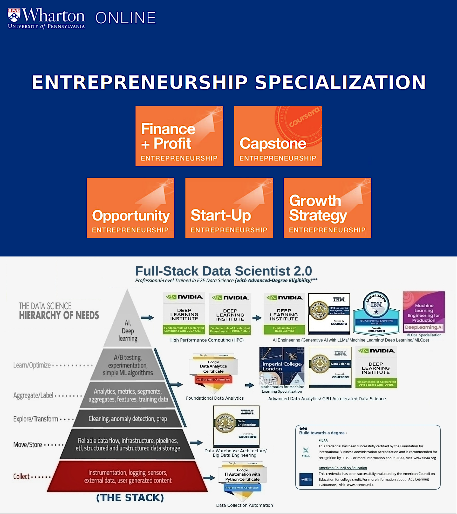](https://www.coursera.org/account/accomplishments/specialization/certificate/V85GHT07OQ4Y)

Akin to the goal of an MVP (Minimum Viable Product) which is to test a product hypothesis using minimal resources, gather insights on customer needs, and iterate rapidly based on real user feedback.

Similarly, the objective of this comprehensive training aligns with the MVP philosophy. We could adopt an "MVP-T" (Minimum Viable Professional-Training) approach, where the focus is on building a strong technical foundation that enables adaptability and future-readiness. This approach ensures a versatile skill set that can be applied across various domains.

Just as an MVP addresses immediate needs while allowing flexibility for future growth, the MVP-T framework emphasizes continuous learning and adaptation. This ensures I stay relevant and equipped to contribute to a range of fields, ultimately driving innovation within the evolving landscape of data science.

## 5. Training and Education:

    

## [NVIDIA Deep Learning Institute](https://learn.nvidia.com/en-us/training/instructor-led-workshops)
- **Non-Degree**  
- **Advanced Technical Workshops in "GPU-Accelerated" Generative AI, Data Science and HPC (High Performance Computing)**  
**2021 - Present**

- **Completed Workshops:**

 ## [Fundamentals of Accelerated Data Science with RAPIDS](https://learn.nvidia.com/courses/course-detail?course_id=course-v1:DLI+C-DS-02+V2)
- [**Advanced Technical Workshop**](https://learn.nvidia.com/en-us/training/instructor-led-workshops)
- **Instructors:** NVIDIA Experts-led Training (GTC Live and Virtual) thru Nvidia DLI platform.
- **Workshop Project Repo: [Github Link!](https://github.com/erwinpasia/NVIDIA-DLI-Advanced-Technical-Workshop-Fundamentals-of-Accelerated-Data-Science-with-RAPIDS)** 
- **Digital Credential:** [**NVIDIA Certificate of Competency!**](https://learn.nvidia.com/certificates?id=ftn3wQNgTWGxt7SvvoEt_g)

[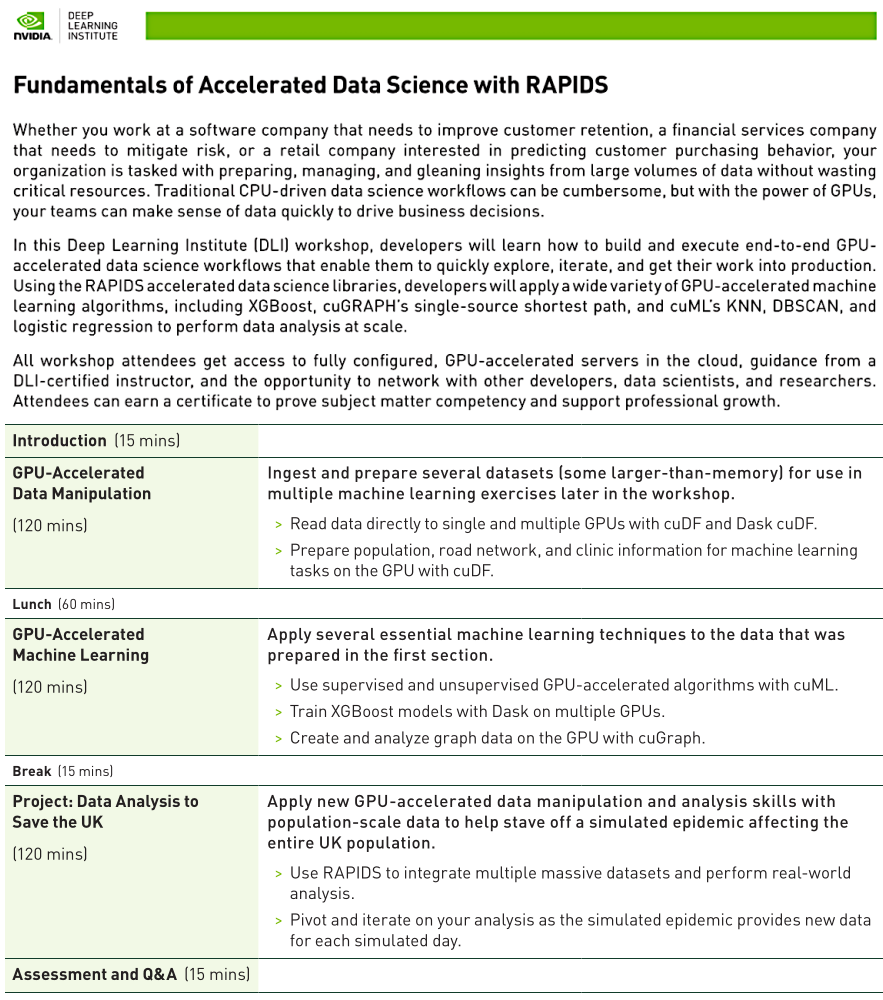](https://learn.nvidia.com/certificates?id=ftn3wQNgTWGxt7SvvoEt_g)

- **Skills:**  
Data Science · RAPIDS · Python (Programming Language) · Pandas (Software) · NumPy · Matplotlib · Scikit-Learn · SciPy · TensorFlow · cuPy · cuDF · cuML · cuGraph

 ## [Fundamentals of Deep Learning](https://learn.nvidia.com/courses/course-detail?course_id=course-v1:DLI+C-FX-01+V3)
- [**Advanced Technical Workshop**](https://learn.nvidia.com/en-us/training/instructor-led-workshops)
- **Instructors:** NVIDIA Experts-led Training (GTC Live and Virtual) thru Nvidia DLI platform.
- **Workshop Project Repo: [Github Link!](https://github.com/erwinpasia/NVIDIA-DLI-Advanced-Technical-Workshop-Fundamentals-of-Deep-Learning)** 
- **Digital Credential:** [**NVIDIA Certificate of Competency!**](https://learn.nvidia.com/certificates?id=KaBzLsMHQ7WuRmGHkMNEVA)

 [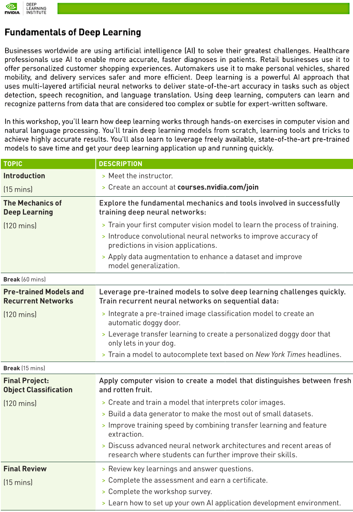](https://learn.nvidia.com/certificates?id=KaBzLsMHQ7WuRmGHkMNEVA)

- **Skills:**  
TensorFlow · Keras · Python (Programming Language) · Pandas (Software) · NumPy · Matplotlib · Scikit-Learn · SciPy

 ## [Fundamentals of Accelerated Computing with CUDA C/C++](https://learn.nvidia.com/courses/course-detail?course_id=course-v1:DLI+C-AC-01+V1)
- [**Advanced Technical Workshop**](https://learn.nvidia.com/en-us/training/instructor-led-workshops)
- **Instructors:** NVIDIA Experts-led Training (GTC Live and Virtual) thru Nvidia DLI platform.
- **Workshop Project Repo: [Github Link!](https://github.com/erwinpasia/NVIDIA-DLI-ATW-Fundamentals-of-Accelerated-Computing-with-CUDA-C_CPP)** 
- **Digital Credential:** [**NVIDIA Certificate of Competency!**](https://learn.nvidia.com/certificates?id=2NmFO4ISQaGCCSDGXK3jdg)

[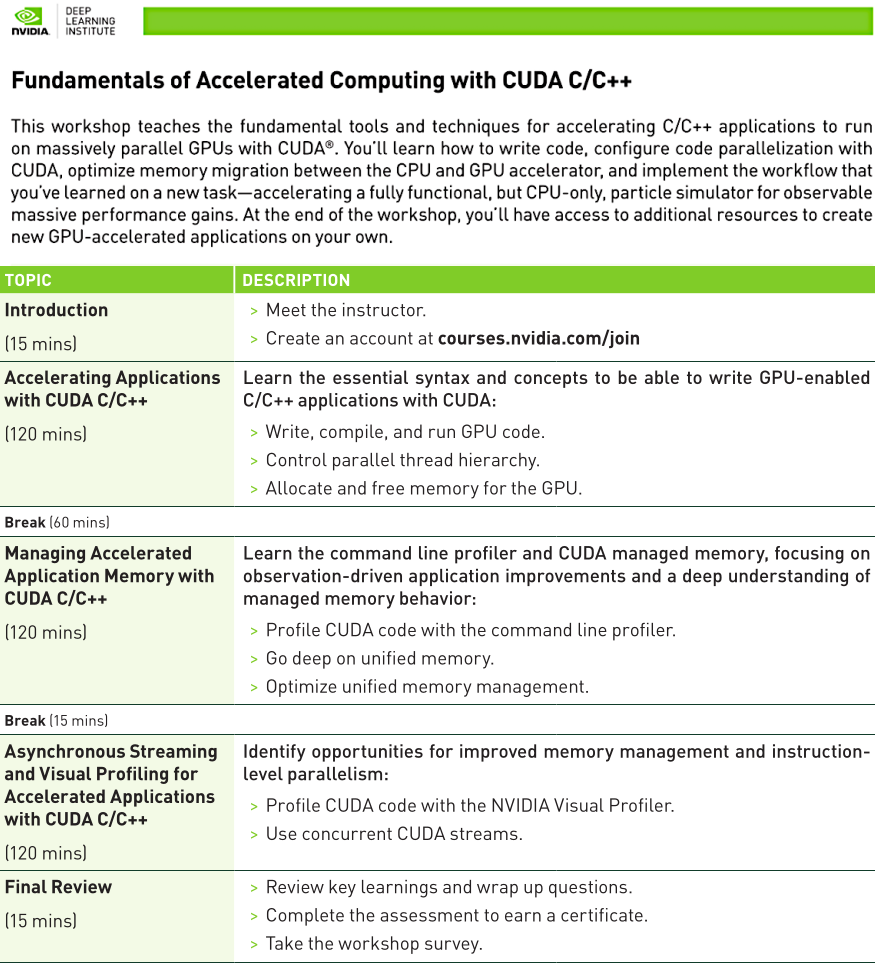](https://learn.nvidia.com/certificates?id=2NmFO4ISQaGCCSDGXK3jdg)

- **Skills:**  
C (Programming Language) · C++ (Programming Language) · CUDA

 ## [Fundamentals of Accelerated Computing with CUDA Python](https://learn.nvidia.com/courses/course-detail?course_id=course-v1:DLI+C-AC-02+V1)
- [**Advanced Technical Workshop**](https://learn.nvidia.com/en-us/training/instructor-led-workshops)
- **Instructors:** NVIDIA Experts-led Training (GTC Live and Virtual) thru Nvidia DLI platform.
- **Workshop Project Repo: [Github Link!](https://github.com/erwinpasia/NVIDIA-DLI-ATW-Fundamentals-of-Accelerated-Computing-with-CUDA-Python)** 
- **Digital Credential:** [**NVIDIA Certificate of Competency!**](https://learn.nvidia.com/certificates?id=WrNAlI26Te2SG2p00EPnRw)

[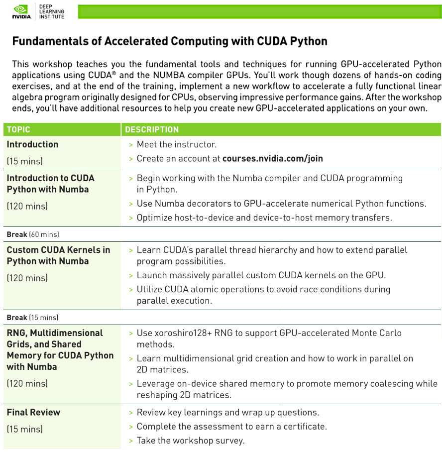](https://learn.nvidia.com/certificates?id=WrNAlI26Te2SG2p00EPnRw)

- **Skills:**  
Python (Programming Language) · Numba · CUDA

 ## [Getting Started in AI with Jetson (Edge AI & Robotics Platform)](https://learn.nvidia.com/courses/course-detail?course_id=course-v1:DLI+C-RX-02+V2)
- [**Advanced Technical Workshop**](https://learn.nvidia.com/en-us/training/instructor-led-workshops)
- **Instructors:** NVIDIA Experts-led Training (GTC Live and Virtual) thru Nvidia DLI platform.
- **Workshop Project Repo: [Github Link!](https://github.com/erwinpasia/NVIDIA-DLI-ATW-Getting-Started-in-AI-with-Jetson)** 
- **Digital Credential:** [**NVIDIA Certificate of Competency!**](https://learn.nvidia.com/certificates?id=95lYXKrHR9WKjKui_RscTg)

[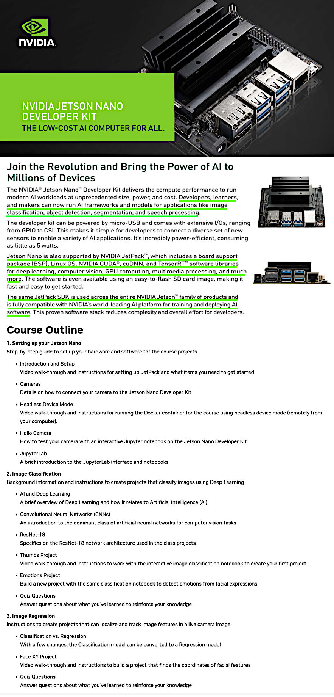](https://learn.nvidia.com/certificates?id=95lYXKrHR9WKjKui_RscTg)

- **Skills:**  
NVIDIA Jetson Developer Kit · Edge AI · Python (Programming Language) · PyTorch · TensorFlow · CUDA · Pandas (Software) · NumPy · Matplotlib · Scikit-Learn · SciPy

---

    

## [Imperial College London-trained in Mathematics for Machine Learning & Data Science](https://www.coursera.org/partners/imperial)
- **Non-Degree**  
- **Instructors:** Imperial College London's Mathematics Professors from the Engineering & Mathematics Departments, thru Coursera Learning Platform.
- **Specialization's Project Repo: [<u>Github Link!</u>](https://github.com/erwinpasia/ERP-Mathematics-for-Machine-Learning-and-Data-Science)**
- **Digital Credential:** [**Specialization Certificate of Competency!**](https://www.coursera.org/account/accomplishments/specialization/certificate/7RY8S3CXD8E9)

[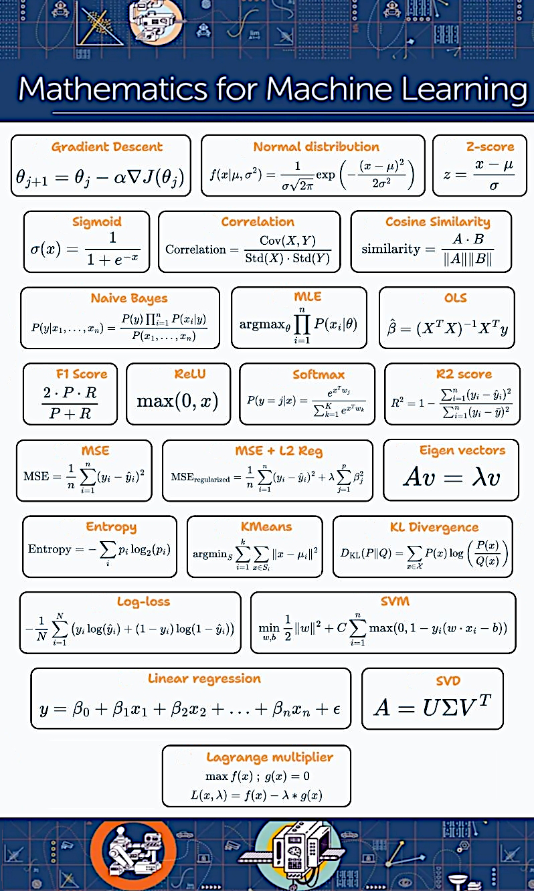](https://www.coursera.org/account/accomplishments/specialization/certificate/7RY8S3CXD8E9)

- **Skills:**  
Linear Algebra · Multivariable Calculus · Principal Component Analysis · Python Programming Language · NumPy · Scikit-learn · Matplotlib · SciPy

---

    

## [DeepLearning.AI-trained in MLOps | Machine Learning Engineering for Production](https://www.deeplearning.ai/)
- **Non-Degree**
- **Instructors:** Andrew Ng (Google Brain Founder), Robert Crowe (Google TensorFlow Advocate), and Laurence Moroney (Google TensorFlow Advocate) thru Coursera Learning Platform.
- **Specialization's Project Repo: [<u>Github Link!</u>](https://github.com/erwinpasia/ERP_Machine_Learning_Engineering_for_Production_Specialization)**
- **Digital Credential:** [**Specialization Certificate of Competency!**](https://www.coursera.org/account/accomplishments/specialization/certificate/JT96BFTD2X97)  
  
[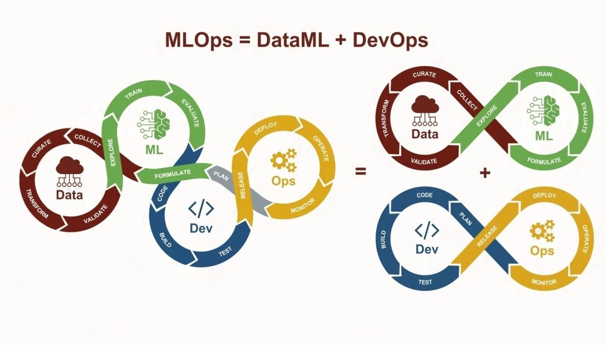](https://www.coursera.org/account/accomplishments/specialization/certificate/JT96BFTD2X97)

- **Skills:**  
TensorFlow · VertexAI · Google Cloud Platform (GCP) · Machine Learning Production Systems · Deployment Pipelines · Model and Data Pipelines · Concept Drift and Model Baseline · Feature Engineering · Monitoring and Maintenance · DevOps Practices · Human-Level Performance (HLP) · Project Scoping and Design

---

    

## [Kaggle Generative AI Intensive with Google & DeepMind — Capstone in "LangGraph-based Agentic AI"](https://www.kaggle.com/learn-guide/5-day-genai)
- [**Non-Degree**]()  
- **Instructors:** Kaggle, Google, and DeepMind Machine Learning Experts-led Generative AI Intensive Training thru Kaggle Platform.
- **Capstone Project Repo: [<u>Github Link!</u>](https://github.com/erwinpasia/ERP_Agentic_Systems_Projects/tree/main/5-Day%20Gen%20AI%20Intensive%20Course%202025%20-%20Kaggle_and_Google)**
- **Digital Credential:** [**Badge Certificate!**](https://www.kaggle.com/certification/badges/erwinrpasia/96)

[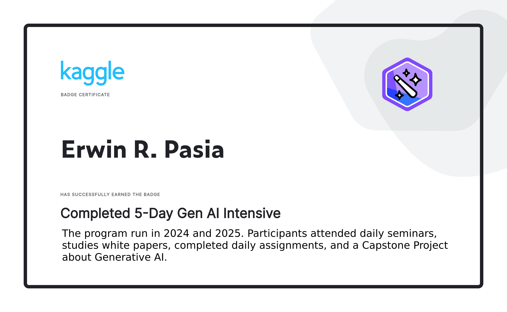](https://www.kaggle.com/certification/badges/erwinrpasia/96)

- **Skills:**  
Agentic AI, AI Agent & RAG Systems: Retrieval-Augmented Generation (RAG), Agentic RAG, Multi-Agent Systems, ReAct (Reason and Act) Framework, Chain of Thought (CoT) Prompting, Vector Database Optimization, Embedding Model Training

- Advanced LLM Development & Fine-Tuning: Direct Preference Optimization (DPO), LoRA/QLoRA Parameter-Efficient Fine-Tuning, Reinforcement Learning from Human Feedback (RLHF), Proximal Policy Optimization (PPO), Supervised Fine-Tuning (SFT), Model Quantization & Distillation

- Generative AI Architecture & Frameworks: Transformer Architecture Design, Mixture of Experts (MoE), Decoder-Only Models, Multi-Head Attention, LangChain Agent Development, Hugging Face Ecosystem, PyTorch Implementation

- Production MLOps & Deployment: Vertex AI Platform, Agent Operations (AgentOps), Model Evaluation & Monitoring, Vector Search at Scale, CI/CD for LLMs, Prompt Engineering & Template Management, Domain-Specific Model Specialization

- Advanced NLP & Evaluation: Automated LLM Evaluation, Human Feedback Integration, Adversarial Testing, Semantic Search, Cross-Modal Embeddings, Few-Shot Learning, Model-Based Auto-Evaluation

---

    

## [IBM Professionally-trained in Generative AI Engineering with LLMs](https://www.ibm.com/training/badge/ibm-generative-ai-engineering-with-llms-specializat.1)
- [**Non-Degree**]()  
- **Instructors:** IBM Experts-led Generative AI Engineering Specialization Training thru Coursera Learning Platform.
- **Capstone Project Repo: [<u>Github Link!</u>](https://github.com/erwinpasia/ERP-Project-Generative-AI-Applications-with-RAG-and-LangChain)**
- **Digital Credential:** [**Specialization Certificate of Competency!**](https://www.credly.com/badges/729b28b7-e25f-4a85-b1b3-bd0b48897c68)

[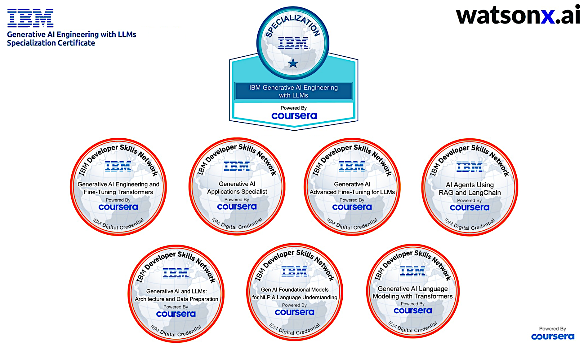](https://www.credly.com/badges/729b28b7-e25f-4a85-b1b3-bd0b48897c68)

- **Skills:**  
Direct Preference Optimization (DPO), Generative AI Architecture, Hugging Face, LangChain, Large Language Models, LoRA and QLoRA, NLP Model Fine-Tuning, Proximal Policy Optimization (PPO), PyTorch, Reinforcement Learning From Human Feedback (RLHF), Retrieval-augmented Generation (RAG)

---

    

## [IBM Professionally-trained in AI/ML Engineering](https://www.ibm.com/training/badge/ibm-ai-engineering-professional-certificate-v2)
### [(Deep Learning with PyTorch, Keras and Tensorflow)](https://www.ibm.com/training/badge/ibm-ai-engineering-professional-certificate-v2)
- [**Advanced-Degree Credits Eligible**](https://www.coursera.org/professional-certificates/ai-engineer?utm_source=IBM&utm_medium=institutions&utm_campaign=IBMBadge#credits)  
- **Instructors:** IBM Experts-led Machine Learning & AI Engineering Professional Training thru Coursera Learning Platform.
- **Capstone Project Repo: [<u>Github Link!</u>](https://github.com/erwinpasia/ERP-AI-Capstone-Project-with-Deep-Learning-V2)**
- **Digital Credential:** [**Credly Professional Badge of Competency!**](https://www.credly.com/badges/029facfa-be3e-4016-b1d1-4070f9f8846c)

[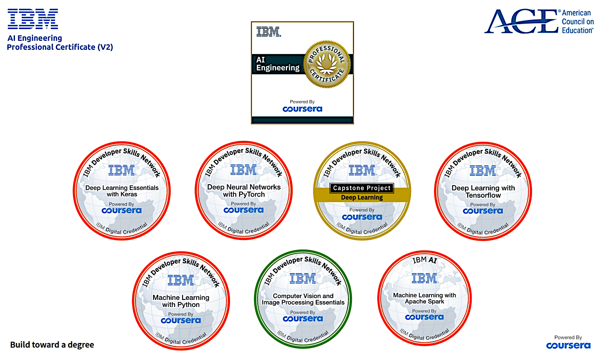](https://www.credly.com/badges/029facfa-be3e-4016-b1d1-4070f9f8846c)

- **Skills:**  
Exploratory Data Analysis · Linear Algebra · Multivariable Calculus · Applied Probability · Statistics · Machine Learning · Pandas (Software) · Matplotlib · NumPy · SciPy · Scikit-Learn · Supervised Learning · Unsupervised Learning · Convolutional Neural Networks (CNN) · Recurrent Neural Networks (RNN) · Deep Learning · Computer Vision · OpenCV · Pillow · Keras · PyTorch · TensorFlow

---

    

## [IBM Professionally-trained in Data Science & Advanced Data Analytics](https://www.ibm.com/training/badge/data-science-professional-certificate)
- [**Advanced-Degree Credits Eligible**](https://www.acenet.edu/National-Guide/Pages/Course.aspx?org=IBM&cid=7bd1e92e-fc8a-ef11-ac21-6045bd043849&oid=6d532c35-75c4-ea11-a812-000d3a33232a)  
- **Instructors:** IBM Experts-led Machine Learning & AI Engineering Professional Training thru Coursera Learning Platform.
- **Capstone Project Repo: [<u>Github Link!</u>](https://github.com/erwinpasia/ERP-Applied-Data-Science-Capstone-Project-V2)**
- **Digital Credential:** [**Credly Professional Badge of Competency!**](https://www.credly.com/badges/5811b8ae-de5c-4907-88a5-d4d6d5fab0a9)

[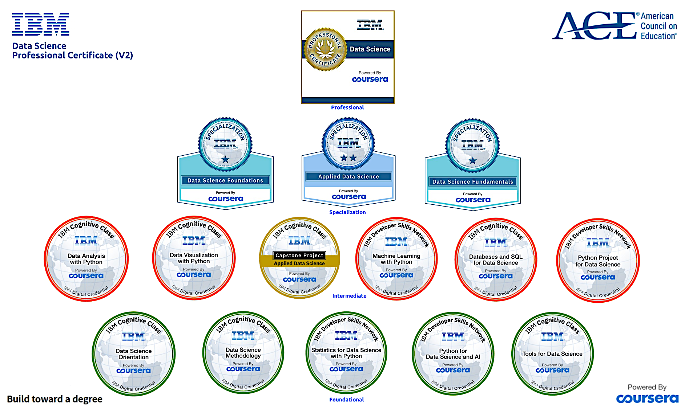](https://www.credly.com/badges/5811b8ae-de5c-4907-88a5-d4d6d5fab0a9)

- **Skills:**  
Analytical Skills · Data Governance · Exploratory Data Analysis · Linear Algebra · Multivariable Calculus · Probability · Statistics · Statistical Analysis · Hypothesis Testing · ANOVA · Python (Programming Language) · Jupyter Notebook · Pandas (Software) · NumPy · SciPy · Matplotlib · Seaborn · Folium · Flask · Data Science · Bokeh Visualization Library · Machine Learning · Scikit-Learn · Supervised Learning · Unsupervised Learning

---

    

## [Google Professionally-trained in Foundational Data Analytics](https://grow.google/certificates/data-analytics/?foundational)
- [**Advanced-Degree Credits Eligible**](https://www.acenet.edu/National-Guide/Pages/Course.aspx?org=Google&cid=c6eec71c-c86b-ef11-bfe3-6045bd0685c2&oid=3fdb1492-e04f-e911-a97b-000d3a363c81)  
- **Instructors:** Google Experts-led Data Analytics Professional Training thru Coursera Learning Platform.
- **Capstone Project Repo: [<u>Github Link!</u>](https://github.com/erwinpasia/ERP-Data-Analytics-R-Capstone-Project)**
- **Digital Credential:** [**Credly Professional Badge of Competency!**](https://www.credly.com/badges/06abf21b-b15c-4cc1-ba73-f9b5c75c0071)

[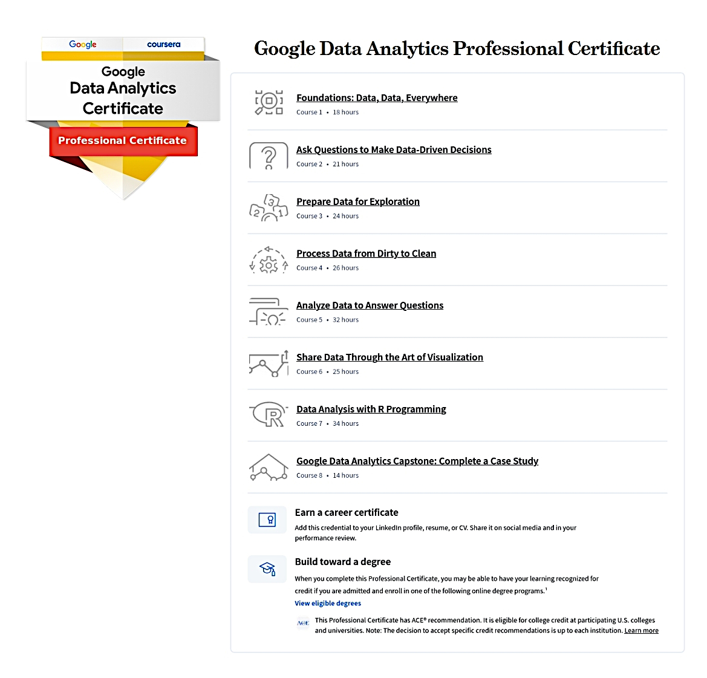](https://www.credly.com/badges/06abf21b-b15c-4cc1-ba73-f9b5c75c0071)

- **Skills:**  
Analytical Skills· Data Analysis· Exploratory Data Analysis· Data Governance· Analytics· SQL· Excel· Tableau· BigQuery· R (Programming Language)· RStudio

---

    

## [IBM Professionally-trained in Data Warehouse & Big Data Engineering](https://www.ibm.com/training/badge/data-engineering-professional-certificate-v2)
- [**Advanced-Degree Credits Eligible**](https://www.acenet.edu/National-Guide/Pages/Course.aspx?org=IBM&cid=aad1e92e-fc8a-ef11-ac21-6045bd043849&oid=6d532c35-75c4-ea11-a812-000d3a33232)  
- **Instructors:** IBM Experts-led Machine Learning & AI Engineering Professional Training thru Coursera Learning Platform.
- **Capstone Project Repo: [<u>Github Link!</u>](https://github.com/erwinpasia/ERP-Data-Engineering-Capstone-Project-V2)**
- **Digital Credential:** [**Credly Professional Badge of Competency!**](https://www.credly.com/badges/d2a32c7b-5b1e-4cd4-886c-3c3deeb6c78e)
  
[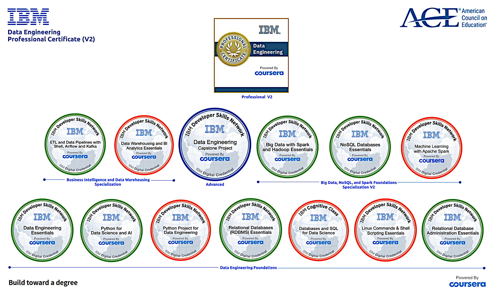](https://www.credly.com/badges/d2a32c7b-5b1e-4cd4-886c-3c3deeb6c78e)

- **Skills:**  
Data Governance · Exploratory Data Analysis · Data Architecture · Data Engineering · Data Modeling · Data Warehouse Architecture · Principal Component Analysis · SQL · NoSQL · Python (Programming Language) · Cassandra · Scala · IBM Db2 · MySQL · PostgreSQL · MongoDB · Extract, Transform, Load (ETL) · Apache Airflow · Apache Kafka · Big Data · ELT · MapReduce · Hadoop · Machine Learning · Pandas (Software) · NumPy · Matplotlib · SciPy · Scikit-Learn · Apache Spark

---

    

## [Google Professionally-trained in IT Automation with Python](https://grow.google/certificates/it-support/?advanced)
- [**Advanced-Degree Credits Eligible**](https://www.coursera.support/s/article/learner-000002117-ECTS-credit-recommendation-FAQs?language=en_US#programs)  
- **Instructors:** Google SREs-led IT Automation & Site Reliability Engineering Professional Training thru Coursera Learning Platform.
- **Capstone Project Repo: [<u>Github Link!</u>](https://github.com/erwinpasia/ERP-IT-Automation-with-Python-Projects)**
- **Digital Credential:** [**Credly Professional Badge of Competency!**](https://www.credly.com/badges/47116441-c734-4380-b36e-36c4eab41073)
  
[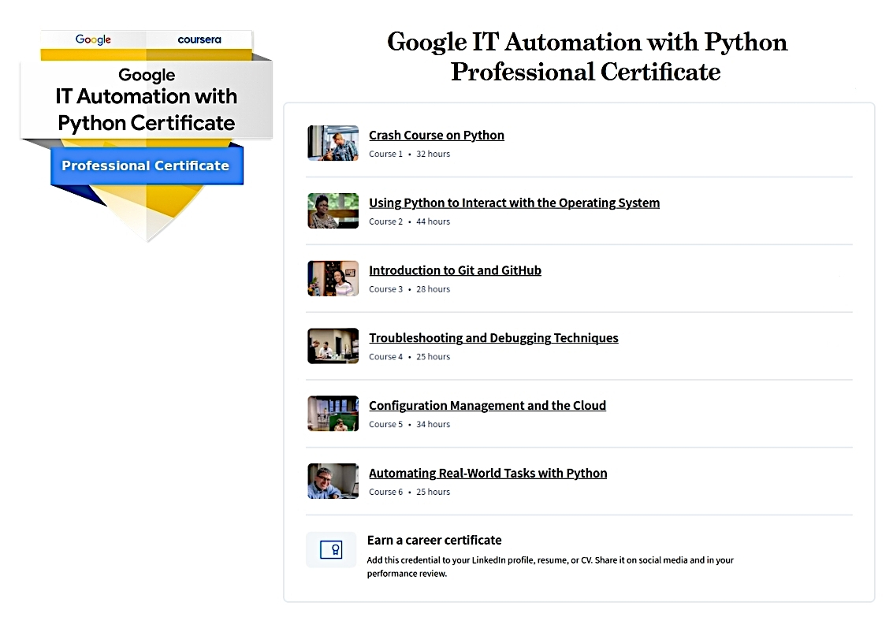](https://www.credly.com/badges/47116441-c734-4380-b36e-36c4eab41073)

- **Skills:**  
Python (Programming Language) · IT Automation · DevOps · Continuous Integration and Continuous Delivery (CI/CD) · Configuration Management · Git · GitHub · Puppet (Software) · Containerization · Kubernetes · Google Cloud Platform (GCP) · Google Kubernetes Engine (GKE)

> "Learning is the source of human progress. It has the power to transform our world from illness to health, from poverty to prosperity, from conflict to peace. It has the power to transform our lives, for ourselves, for our families, and for our communities. No matter who we are or where we are, learning empowers us to change, grow, and redefine what's possible." -C.I-
>
> Keep Learning and Stay Curious!
